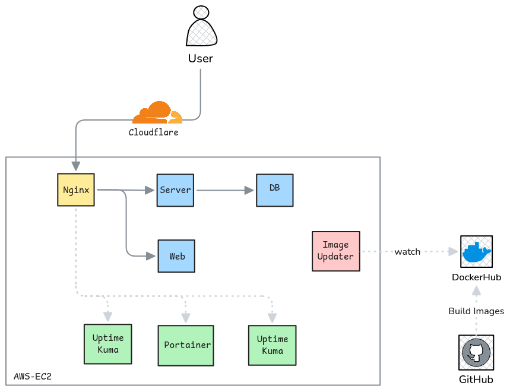

# PokeSocket


A small and simple Pokemon game for playing on the web. Gotta catch 'em all!

## 📦 Dependencies

Before you get down to rock some code, you need these programs installed on your PC:

- Docker
- Go
- Go Air (hot reload for Go apps)
- Node
- PNPM (Node package manager)
- process-compose
- Moon (task manager)
- Postgres 17

If you don't want to install them all, this project supports [**Nix**](https://nixos.org/) for installing everything for you.

### Why this stack?

When starting this project I detected 3 constraints that defined the selected stack:

| Constraint | Solution | Why it works |
|------------|----------|--------------|
| Should be accessible to everyone | **Vue 3** as a web interface | Everyone has a browser — no installs needed for players. |
| Running on a server with very low resources (2 GB RAM & 1 CPU core) | **Go** for the backend | Compiles to a single binary with minimal memory footprint and excellent concurrency via goroutines. |
| Highly concurrent app where DB transactions matter | **PostgreSQL** for the database | Handles concurrent connections well and provides ACID transactions out of the box. |

## 🚀 Getting Started

The easiest way to spin up everything is by using Docker Compose to build the required containers for the app. **Other containers were added for the deployed environment.**

```bash
docker compose up --build # Run in the root of this repo
```

The following services will be started:

| Service    | Port   | Description                  |
|------------|--------|------------------------------|
| `client`   | `8080` | Vue 3 web application        |
| `server`   | `3003` | Go WebSocket backend         |
| `postgres` | `5432` | PostgreSQL database           |

## 📂 Project Structure

The whole project is structured as a monorepo for ease of use in the testing pipeline. Here are the main folders:

- [`server/`](./server/) — Source code for the PokeSocket server.
- [`client/`](./client/) — Source code for the PokeSocket web client.
- [`db/`](./db/) — Configuration for the project database.
- [`infra/`](./infra/) — Configuration files for services deployed in the production environment.

**Please check those folders for more information.**

## 🏗️ Infrastructure

My favorite part! I didn't want to run each service on the server via SSH and call it a day :/

**I wanted a fully fleshed-out production environment with continuous integration** that an administrator would actually like to work with. So here it is:



Each box is a containerized app and arrows represent direct network traffic connections between them. Below is the description of each service:

| Service | Description |
|---------|-------------|
| **Cloudflare** | Adds an extra layer of security by proxying all traffic through Cloudflare's DNS system. |
| **Nginx** | Acts as the gateway for public internet traffic within the private Docker network, routing requests to the proper service and adding TLS encryption. |
| **Server** | The brain of the PokeSocket app. Currently handles all traffic on its `/battle` endpoint. |
| **DB** | Stores battle information and Pokemon types. Built with PostgreSQL. |
| **Web** | The PokeSocket web application. |
| **Uptime Kuma** | A monitoring service that checks each service is running and healthy. Offers a dashboard to view their status. |
| **Portainer** | Lets you manage all containers running on the host via a web GUI. |
| **Image Updater (WUD)** | Checks for image updates in the container registry and pulls them automatically. This is the key piece that makes the deployment flow fully automatic. |

## 🔄 CI/CD

You may want to check for actual runs [here](https://github.com/DanielRasho/PokeSocket/actions/runs/21841440383) or [here](https://github.com/DanielRasho/PokeSocket/actions/runs/21841556209)

### 🧪 Tests

The server has a suite of integration tests that run on every pull request to ensure code quality.


### 🐳 Builds

Docker images are built via GitHub Actions and pushed to a [Docker registry](https://hub.docker.com/u/smaugtur), which the production environment pulls from.


### 🚀 Deployment Pipeline

```
Pull Request → Tests Pass → Merge to Main → Build Images → Push to Registry → WUD Detects Update → Auto Deploy
```

The full CI/CD flow works as follows:

1. A **pull request** triggers the integration test suite.
2. Once tests pass and the PR is merged, **GitHub Actions** builds the Docker images.
3. Images are pushed to the **Docker Hub registry**.
4. **WUD (What's Up Docker)** on the production server detects the new images and updates the running containers automatically.
