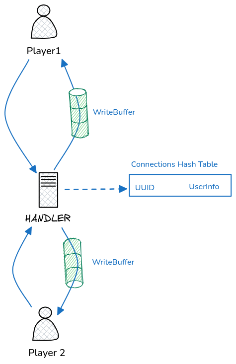

# Server

The service I put more love into ❤️

## 🚀 Running the Dev Server

This project uses [Moon](https://moonrepo.dev/) as a monorepo task runner. From the repository root:

```bash
moon run server:dev
```

This starts the Go backend with [Air](https://github.com/air-verse/air) for hot-reload on file changes.

## 🏗️ Overall Architecture

Since PokeSocket was constrained to run in a production environment with low memory, most of the battle state is stored in the database and consulted whenever necessary, while user connection info is kept in an in-memory hashtable.



### 🧠 The Clever Part

To handle parallel connections efficiently, two mechanisms were implemented in the `Connection` object:

1. **Write Buffers**: Each connection has a buffered `Send` channel (capacity of 4 messages) that acts as a queue and sends the messages asyncronally. **This allows handlers to never block waiting on a slow client.** 

2. **Connection Health (Ping)**: A background threads pings each client every 30 seconds. If a ping fails, the connection is closed.

[**Check implementation here**](./internal/handlers/ws_h/connection.go)

### 🔄 Request Flow

```
          ENTRY_POINT            <-- one per message type
               |
               v
          WS HANDLER
               |
   +-----------+-----------+
   v           v           v
SERVICE1    SERVICE2    SERVICE3
               |           |
               v           |
           DB_CLIENT <------+
```

1. **Handler** -- Receives, validates, and parses the incoming message. Orchestrates services to execute the action and build the response.
2. **Service** -- Business logic for a single entity. Interacts with the database and performs domain-level validations.
3. **DB Client** -- Data access layer. Most of the code here is auto-generated by `sqlc`.

### 📂 Folder Structure

```
.
├── db
│   └── queries.sql     # DB queries (produce)
├── internal
│   ├── config          # Env pulling cofig data
│   ├── handlers        # Websocket and HTTP handlers
│   ├── middlewares     # hadlers middlewares
│   ├── services        # Core bussines logic
│   └── storage         # Database interaction code
├── tests
│   ├── helpers.ts      # helper function for tests
│   ├── integration     # integration tests
├── utils               # Misc code
```

## 🧪 Tests & Documentation

**Good test are also good documentation that is always up-to-date**, check them out in the `./tests/` dir

### Running Tests

```bash
# All integration tests
moon run server:test

# A single test file
cd server && pnpm vitest run tests/integration/battle.test.ts
```

Tests require the database and server to be running. The `process-compose.yaml` at the repo root orchestrates this automatically for CI.


## 📨 Message Types

Client and server communicate through JSON messages with a numeric `type` field and a `payload` object.

**Client -> Server**

| Type | Code | Description |
| ---- | ---- | ----------- |
| Connect       | 1 | Register username and Pokemon team |
| Attack        | 2 | Attack with a move |
| ChangePokemon | 3 | Switch active Pokemon |
| Surrender     | 4 | Forfeit the battle |
| Status        | 5 | Request current battle state |
| Match         | 6 | Join the matchmaking queue |

**Server -> Client**

| Type | Code | Description |
| ---- | ---- | ----------- |
| AcceptConnection | 50 | Registration accepted |
| Attack           | 51 | Attack result (both players receive) |
| ChangePokemon    | 52 | Switch result |
| Status           | 53 | Current battle state snapshot |
| BattleEnded      | 54 | Battle over, includes winner |
| Disconnect       | 55 | Server-initiated disconnect |
| Error            | 56 | Error with code and details |
| MatchFound       | 57 | Opponent found, battle created |
| QueueJoined      | 58 | Placed in matchmaking queue |
